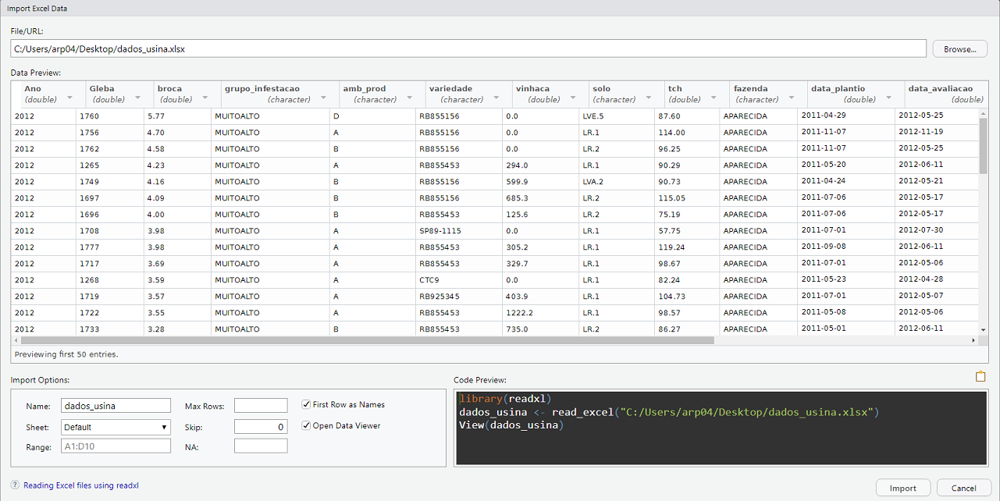
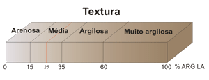

# 1. Material Base do Curso

Textos podem ser encontrados gratuitamente online!


Long, J. D. & Teetor, P. (2019) R Cookbook. USA: O’Reilly Media, Inc, https://rc2e.com/.


Wickham, H. & Grolemund G. (2019) R for Data Science. https://r4ds.had.co.nz/.

# 2. Ciência dos Dados (Data Science)

É uma área interdisciplinar voltada para o estudo e a análise de dados, estruturados e não-estruturados, que visa a extração de conhecimento, detecção de padrões e/ou obtenção de variáveis para possíveis tomadas de decisão. O modelo base das ferramentas necessárias em um projeto típico de ciência dos dados é parecido com isso:


**Importar os dados:** Sem eles no R, não conseguimos fazer nada...

**Organizar os dados:** De forma consistente que combine a semântica da base de dados com a maneira em que são armazenados.


Exemplo de dados organizados em uma planilha eletrônica, onde cada coluna é uma variável e cada linha é uma observação.

**Transformar os dados:** Literalmente, recortar o banco de dados, assim podemos focar nas observações de interesse. Criar novas variáveis em função das existentes e calcular, por exemplo, um resumo estatístico desse conjunto de interesse. 

Agora podemos gerar o conhecimento, através da **Visualização** e **Modelagem**.


**Comunicação**: É a última etapa do data science, a mais importante.

Uma dica importante, estudar um pouco de **RMarkdown**! Ótima linguagem de marcação de texto, utilizada para gerar relatórios em HTML, .doc e pdf.


https://bookdown.org/yihui/rmarkdown-cookbook/

# 3. Motivação

**PROGRAMAÇÃO:** Permeia todas as etapas da Ciência dos Dados.

Uma questão recursiva...

O computador é a ferramenta do cientista de dados.

    

R é um ambiente e linguagem de programação de código aberto para computação estatística, bioinformática e gráficos.

  * Como linguagem de programação, garante a reprodutibilidade das análises.
  
    + Estudantes podem usar as mesmas ferramentas que os profissionais.

    + Todos podem usar as melhores ferramentas independente do poder financeiro.

    + Qualquer um pode reproduzir as suas análises.

    + Você pode corrigir problemas.

    + Você pode desenvolver suas próprias ferramentas.

  * Linguagem orientada a objetos R  (Ross Ihaka e Robert Gentleman).

  * R é uma poderosa linguagem, flexível e possui excelentes facilidades gráficas.

  * R é um projeto **open-source** e está disponível na internet sobre a General Public License (<www.gnu.org/copyleft/gpl.html> e <www.fsf.org>).


# 4. Ambientação

### 4.1. Instalando o R

Baixe o R do site oficial The R Project for Statistical Computing <https://www.r-project.org/>

Acesso rápido: [Download](<https://cran-r.c3sl.ufpr.br/bin/windows/base/R-4.0.3-win.exe>)


Salve o arquivo de instalação em um diretório de seu computador e em seguida execute-o. 

O processo é simples e intuitivo.

### 4.2. Instalando o RStudio

É um ambiente de desenvolvimento integrado (IDE) para o R, disponível em <https://rstudio.com/products/rstudio/download/>

Escolha a o instalador de acordo com o seu sistema operacional. **Windows** no nosso caso.

Novamente, salve o arquivo de instalação em um diretório de seu computador e em seguida execute-o.

Após a instalação procure o ícone do R criado pelo instalador e clique nele.


# 5. Pacotes no R (instalação dos pacotes)

Um pacote é uma coleção de funções, exemplos e documentação. A funcionalidade de um pacote é frequentemente focada em uma metodologia estatística especial" (**Everitt & Hothorn**).

 

Liste os pacotes carregados no ambiente com:

```{r}
(.packages())
```

Carregue um pacote, utilize a função `library`.

```{r,message=FALSE}
library(tidyverse)
```

Agora, liste novamente os pacotes e observe a diferença no retorno da função.

```{r}
(.packages())
```


**Utilizando a opção** `Install/Packages`

Instale alguns pacotes:  
 
 * `tidyverse`   
 * `agricolae`  
 * `readxl`
 * `stringr`
 * `lubridate`

# 6. Operações Básicas

### 6.1. Operação aritmética
$$
\begin{aligned}
& a) 1+7 = 8\\
& b)1 - 2 \times10 = 19\\
& c) 2^{10} = 1024\\
& d) \frac{10}{3} = 3.33333
\end{aligned}
$$

```{r,eval=FALSE}
1 + 7 
1 - 2 * 10 
2 ** 10 
10/3 
```

### 6.2. Algumas funções matemáticas e trigonométricas 
$$
\begin{aligned}
& a)\;\sqrt{9} = 3\\
& b)\;seno\;\pi = 0\\
& c)\;4! = 24\\
& d)\; e^5 = 148,4132
\end{aligned}
$$
```{r,eval=FALSE}
sqrt(9) 
sin(pi) 
factorial(4)
exp(5)
```

### 6.3. Operações Relacionais

$$
\begin{aligned}
& a)\;7 > 5 \text{ retorna 'verdadeiro'}\\
& b)\;8 \leq 4 \text{ retorna 'falso'}\\
& c)\;5 = \frac{25}{5} \text{ retorna 'verdadeiro'}\\
& d)\; 4\neq 8 \text{ retorna 'verdadeiro'}
\end{aligned}
$$

```{r}
7 > 5 ; 4 != 8
nome <- 'Alan'
nome == 'Rodrigo'
nome == "Alan"
```


### 6.4. Operações Lógicas

$$
\begin{aligned}
& a)\;7 > 5 \; OU \; 8 \leq 4 \text{ retorna 'verdadeiro'}\\
& b)\;5 = \frac{25}{5} \; E \; 4 > 8 \text{ retorna 'falso'} \\
& c) \text{ Não} \; \text{TRUE}\; \text{retorna 'falso'} \\
& d) \text{ Não} \; \text{FALSE} \; \text{retorna 'verdadeiro'}
\end{aligned}
$$

```{r, eval=FALSE}
7 > 5 | 8 <= 4 
5 == 25/5 & 4 > 8
!TRUE
!FALSE

x <- c(1, 4, 2, NA, 8)
is.na(x)
x[!is.na(x)]
```

# 7. O R como uma calculadora

Resolva as seguintes expressões:
$$
\begin{aligned}
& a)\; log\;3 \\
& b)\; ln\;10\\
& c)\; e^{2,302585}\\
& d)\; \sqrt(225)\\
& e)\; 5!\\
& f)\; seno\;30°\\
\end{aligned}
$$

```{r,eval=FALSE}
log10(3)
log(10)
round( exp(2.302585) )
sqrt(225)
factorial(5)
sin(30*pi/180)
```

# 8. Tipos de dados, atribuição e principais objetos no R

### 8.1. Tipos de dados

Principais tipos de dados no R, como o computador interpreta a informação.

```{r,eval=FALSE}
# Caracter
letters
LETTERS
'Aluno'
"1235"

# Inteiro
1235
-4

# Double (ponto flutuante)
3.14
1/8
sqrt(7)

# Lógico
TRUE
FALSE
```

### 8.2. Atribuição

Símbolo utilizado para guardar uma informação em um objeto no R.

```{r,eval=FALSE}
x <- pi
y <- -5:5
nome <- "Cartola"
res  = (nome == "Alan")
x <- 4 # atribuição tem caráter destrutivo, ele sobrescreve a informação
X <- pi
```

### 8.3. Objetos

#### Escalar
É um objeto ao qual é atribuído um valor que pode ter qualquer um dos tipos.

```{r}
x <- 10
"Maria" -> nome # Não muito utilizado
```

Quando uma estrutura de dados é composta de variáveis com o mesmo tipo primitivo, temos um conjunto de dados homogêneo (vetores, fatores e matrizes). 

#### Vetor

É considerada a **forma mais simples de armazenamento de dados** em um objeto, são classificados como variáveis com **um ou mais valores do mesmo tipo**. Na verdade, um escalar para o R é definido como um vetor com um único elemento. 
Essa estrutura de dados tem o 1 como índice inicial. E podem ser referenciados por **[k]** onde k é a posição do elemento no vetor.


```{r}
# Criando um vetor e acessando um valor
z<-c(3,2,7,4,5)
z[3]

# Criando sequências
x <- 1:100
sequencia <- seq(0,100,12)
vetor <- rep(1,10)
test <- rep("testemunha",4)

# Obtendo informações de objetos
is.vector(x)
is.vector(z)
length(x)
```


```{r}
# Uma matriz, tem a dimensão de linha de coluna
A <- matrix(c(1,2,3,4,5,6,7,8,0), byrow = FALSE, ncol=3)
A

det(A)
solve(A)
round(A %*% solve(A))
(A %*% solve(A)) %*% A
```

Um conjunto heterogêneo de dados é composto por elementos que não são do mesmo tipo primitivo, como exemplo, temos os data.frames e as listas (ou registros).

#### Data Frames   
Os data.frames são considerados a **melhor forma de armazenar dados**, pois cada linha corresponde a uma observação e cada coluna representa uma medida realizada em cada unidade (característica ou variável).

```{r}
# Criando vetores
RA <- c(1933456,1935432,1869524)
Nome <- c("Maria Eduarda Ferreira","Paulo Antunes Arantes","Ricardo Luís Siqueira")
Média <- c(9.5,7.75,4.8)
Situação <- c("Aprovado","Aprovado","Exame")

# Criando o data.frame
NOTAS <- data.frame(RA, Nome, Média,Situação)

# Obtendo Informações
length(NOTAS)
length(RA)
dim(NOTAS)
nrow(NOTAS)

NOTAS[c(1,3),3:4]

```


# 9. Entrada de dados

### 9.1. Lendo diretamente da internet

Acesse o GitHub do Professor <https://github.com/arpanosso/cursoR_conbea_2020>

```{r}
dados <- read.table("https://raw.githubusercontent.com/arpanosso/cursoR_conbea_2020/main/dados/geomorfologia.txt", 
                    h=TRUE,
                    sep="\t")
```

### 9.2. Banco de dados em TXT  
Faça o download do banco de dados [geomorfologia.txt](https://raw.githubusercontent.com/arpanosso/cursoR_conbea_2020/main/dados/geomorfologia.txt)

```{r}
dados <- read.table("C:/R/geomorfologia.txt",h=TRUE,sep="\t")
```

### 9.3. Dados do Excel

Faça o download do banco de dados [geomorfologia.xlsx](https://github.com/arpanosso/cursoR_conbea_2020/raw/main/dados/geomorfologia.xlsx)




```{r}
library(readxl)
# geomorfologia <- read_excel("C:/Users/Panosso/Desktop/geomorfologia.xlsx")
# View(geomorfologia)
```

# 10. Manipulação dos dados

Para a manipulação dos nossos dados, vamos utilizar o pacote `dplyr`, que é um pacote específico para a manipulação de dados, unido ao pacote `ggplot2` é um poderoso recurso para exploração, transformação e visualização de dados. Ambos os pacotes fazem parte do `tidyverse`, que, como já dito, é um pacote de pacotes.

#### 10.1. Principais funções (verbos) do `dplyr`.  

  * `filter()`: seleciona/filtra por linhas (observações) a base de dados  
  * `arrange()`:  ordena a base de dados de acordo com alguma coluna (variável)  
  * `select()`:  seleciona colunas (variáveis)  
  * `mutate()`:  modifica/transforma/cria variáveis (colunas)  
  * `summarise()`:  resume/agrega, variáveis (colunas) de uma base de dados  

#### 10.2. Regras para manipulação:  
   1- O primeiro argumento sempre será um `data.frame`.  
   2- Demais argumentos, descrevem como deve ser a manipulação.  
   3- A resposta sempre será um `data.frame`.  
   4- Manipulação é realizada com o operador "PIPE" (`%>%`) - `CTRL SHIFT + M`.  

#### 10.3. glimpse

A função `glimpse` retorna uma visão rápida a respeito da base de dados.

```{r}
glimpse(dados)
```

#### 10.4. filter

**Exemplo 1:** Selecione as observações **linhas** para superfície geomórfica igual a "II".

```{r}
dados %>% 
  filter(SUP == "II") %>% 
  View()
```

**Exemplo 2:** Crie outro banco de dados para aqueles registros com toer de argila maior que 10%, provenientes da superfície "I".
```{r}
dados %>% 
   filter(ARGILA > 10, SUP == "III") %>% 
   View()
```

**Exemplo 3:** Desse novo objeto, selecione todas as observações que não sejam Regossolo.
```{r eval=FALSE}
df %>% 
  filter(Solo != "R") %>% 
  View()
```


**Exemplo 4:** Quantos pontos experimentais existem em cada uma dessas superfícies?

```{r eval=FALSE}
dados %>% 
  group_by(SUP) %>% 
  count(SUP) %>% 
  View() 
```

**Exemplo 5:**. Selecione todos os Latossolos.
```{r eval=FALSE}
library(stringr) # pacote para manipulação de strings, ou seja, cadeias de caracteres
dados %>% 
  filter(str_detect(Solo,"^L")) %>% # ^, significa "começa com"
  View()
```


**Exemplo 6:**. Selecione os registros cujo solo é "PV4"
```{r eval=FALSE}
da <- dados %>% 
  filter(str_detect(Solo,"PV4"))
mod<-lm(da$Ca~da$Mg)
plot(da$Ca~da$Mg,pch=16,cex=1.4,col="red")
abline(mod,col="blue",lty=2)
summary.lm(mod)
```


**Exemplo 7:**. Selecione os registros cujo nome do solo termina com o "p"
```{r eval=FALSE}
dados %>% 
  filter(str_detect(Solo,"p$")) # $, significa, "termina com"
```


#### 10.5. arrange

**Exemplo 1:**. Classifique os registros por ordem crescente de teor de argila
```{r eval=FALSE}
dados %>% 
  arrange(ARGILA) 
```

**Exemplo 2:**. Classifique os registros por ordem decrescente de teor de acidez $H+Al$.
```{r eval=FALSE}
dados %>% 
  arrange(desc(H_Al)) %>% 
  View()
```

**Exemplo 3:**. Classifique os registros por ordem alfabéticas de solos por ordem decrescente de teor de fósforo disponível no solo.
```{r eval=FALSE}
dados %>% 
  arrange(Solo,desc(P)) %>% 
  View()
```

#### 10.6. select

Seleciona colunas de uma tabela e pode ser utilizado com as funções: 


    * starts_with("abc"): seleciona nomes que começam com "abc"

    * ends_with("xyz"): seleciona nomes que terminam com "xyz"

    * contains("ijk"): seleciona nomes que contêm "ijk"

    * matches("(.)\\1"): seleciona nomes usando Expressões Regulares

    * num_range("x", 1:3): seleciona x1, x2 e x3


**Exemplo 1:**. Selecione as colunas SUP, Solo e ARGILA.
```{r eval=FALSE}
dados %>% 
  select(SUP, Solo, ARGILA) %>% 
  View()
```

**Exemplo 2:**. Selecione as colunas que comecem com a letra "A".
```{r eval=FALSE}
dados %>% 
  select(starts_with("A")) %>% 
  View()
```

**Exemplo 3:**. Selecione as colunas que NÃO comecem com a letra "A".
```{r eval=FALSE}
dados %>% 
  select(-starts_with("A")) %>% 
  View()
```

#### 10.7. mutate

**Exemplo 1:**. Calcule a soma dos teores de ARGILA + SILTE e, em seguida, coloque o teor de fósforo na escala logarítmica.

```{r eval=FALSE}
dados %>% 
  mutate(
    ARG_SILT = ARGILA + SILTE, # primeira transformação
    log_P = log10(P) # segunda transformação
  ) %>% 
  View()
```

**Exemplo 2:**. Classifique a Textura do solo.


```{r eval=FALSE}
dados %>% 
  mutate(
    TEXTURA = case_when(
        ARGILA < 15 ~ "Arenosa",
        ARGILA <= 35 ~ "Media",
        ARGILA <= 60 ~ "Argilosa",
        ARGILA > 60 ~ "Muito argilosa",
        TRUE ~ "Sem classificação")
  )
```

#### 10.8. summarise e group_by

Resumo/Agrega o conjunto de dados

**Exemplo 1:**. Calcule as estatísticas descritivas para alguns atributos do solo de sua preferência. 

```{r eval=FALSE}
dados %>% 
  group_by(SUP) %>% 
  summarise(N=length(Ca),
            media = mean(Ca),
            mediana =median(Ca),
            variancia = var(Ca),
            assimetria = agricolae::skewness(Ca)
  )
```

# 11. Gráficos usando o ggplot2

**Exemplo 1:**. Construa um gráfico de dispersão entre os teores de Ca e Mg.
```{r}
# chamar os dados
# filtrar, agrupar, gerar estatísticas se necessário
# adicionar as camadas gráficas com o sinal de adição "+"

# Gráfico de Dispersão
dados %>% 
  ggplot(aes(x=Mg,y=Ca) ) +
  geom_point()
```

**Exemplo 2:**. Construa um gráfico de dispersão entre a ARGILA e SILTE, mapeie as Superfícies por meio das cores no novo gráfico.
```{r}
dados %>% 
  ggplot(aes(x=ARGILA,y=SILTE,col=SUP) ) + # dizer quem será o x e o y dentro de aes
  geom_point(size=2)+
  scale_color_manual(values=c('blue','darkgreen','orange'))
```

**Exemplo 3:**. Construa um gráfico de dispersão entre a Ca e Mg, mapeie as Superfícies por meio das formas dos marcadores no novo gráfico.
```{r}
dados %>% 
  ggplot(aes(x=Mg,y=Ca)) + 
  geom_point(aes(shape=as.factor(SUP)),size=2)
```


**Exemplo 4:**. Adicione os títulos dos gráficos, eixos e legendas.
```{r}
dados %>% 
  ggplot(aes(x=ARGILA,y=SILTE) ) + # dizer quem será o x e o y dentro de aes
  geom_point(aes(shape=as.factor(SUP)),color="orange",size=2)+
  theme_minimal()+
  labs(x="Teor de Argila (%)",y="Teor de Silte (%)",shape="Superfície") +
  ggtitle("Gráfico de dispersão",subtitle = "Conbea 2020")
```

**Exemplo 5:**. Criar um gráfico de barras, com os solos presentes na superfície "III".
```{r}
dados %>% 
  filter(SUP=="III") %>% 
  group_by(Solo) %>% 
  summarise(n=n()) %>% 
  mutate(perc=n/sum(n)) %>% 
  ggplot(aes(x=Solo, y=perc))+
  geom_col()
```

**Exemplo 6:**. Altere os eixos e as cores do gráfico anterior.

```{r}
# Gráfico de Barras
dados %>% 
  filter(SUP=="III") %>% 
  group_by(Solo) %>% 
  summarise(n=n()) %>% 
  mutate(perc=n/sum(n)) %>% 
  ggplot(aes(x=Solo, y=perc))+
  geom_col(fill="aquamarine4") +
  coord_flip()
```


**Exemplo 7:**. Ordene o banco de dados dos Solos mais observados para os menos observados.
```{r}
# Gráfico de Barras
dados %>% 
  group_by(Solo) %>% 
  summarise(n=n()) %>% 
  mutate(perc=n/sum(n),
         Solo = Solo %>% fct_lump(n=10,w=perc) %>% fct_reorder(perc)) %>% 
  ggplot(aes(x=Solo, y=perc))+
  geom_col(fill="orange") +
  coord_flip()
```


**Exemplo 8:**. Criar o gráfico de colunas para as médias de Teor de ARGILA para cada Solo.
```{r,message=FALSE}
dados %>% 
  group_by( Solo) %>% 
  summarise(argila=mean(ARGILA)) %>% 
  ggplot(aes(x=Solo,y=argila,fill=as.factor(Solo))) +
  geom_col()+
  labs(fill="Solo")
```

**Exemplo 9:**. Adicione a linha de tendência linear entre Ca e Mg para cada SUP.
```{r, message=FALSE}
# Gráfico das médias por ano em cada fazenda
dados %>% 
  group_by(SUP) %>% 
  ggplot(aes(x=Mg,y=Ca,color=as.factor(SUP))) +
  geom_point()+
  facet_wrap(~SUP)+  # scales = "free", se necessário
    geom_smooth(mapping = aes(x=Mg, y=Ca), 
              method="lm",
              color="red",lwd=.6,lty=2, 
              se=FALSE)+
  labs(col="Superfície")
```

**Exemplo 10:**. Construa o gráfico de distribuição de frequência para as variáveis contínuas do banco de dados.
```{r}
# Hitograma das variáveis contínuas
dados %>% 
  group_by(SUP) %>% 
  ggplot(aes(x=ARGILA))+
  geom_histogram(aes(y=..density..),color="black",fill="white",bins=30)+
  geom_density(alpha=.2,fill="salmon")+
  geom_vline(aes(xintercept=mean(ARGILA)),color="blue",size=1.6,linetype="dashed")
```
**Exemplo 11:**. Construa o gráfico de distribuição de frequência para uma variável específica em cada superfície.

```{r}
dados %>% 
  group_by(SUP) %>% 
  ggplot(aes(x=Mg))+
  geom_histogram(aes(y=..density..),color="black",fill="white",bins=30)+
  geom_density(alpha=.2,fill="salmon")+
  facet_wrap(~SUP,scales = "free")
```


## Exemplo de Violin plot  
```{r}
dados %>%
  ggplot(aes(y=ARGILA,x=as.factor(SUP),fill=as.factor(SUP))) +
  geom_violin(trim = FALSE) +
  stat_summary(fun = mean, geom = "point",shape=23,size=2,color="black",fill="gray")+
  labs(fill="Superfície")+
  scale_fill_manual(values=c('blue','darkgreen','orange'))
```
